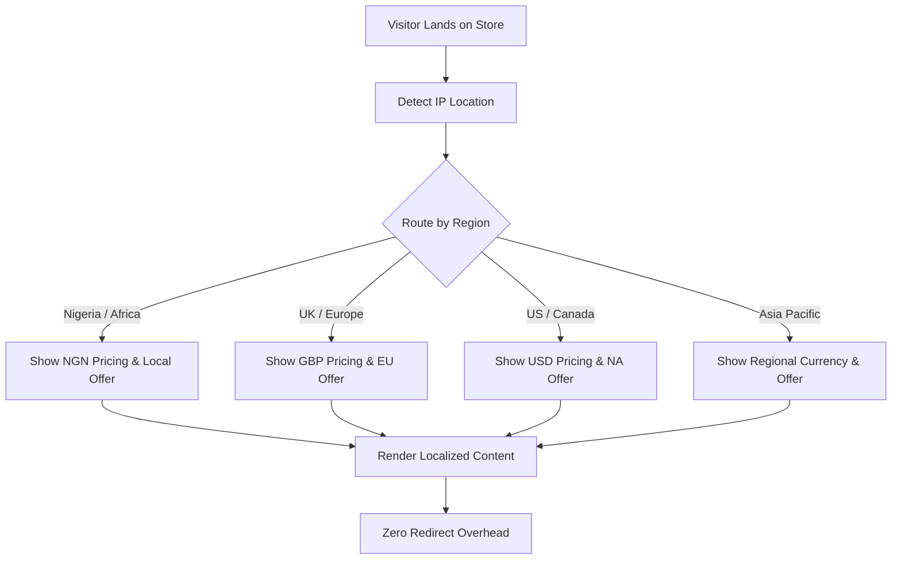

# Shopify Geo Personalizer


A dynamic geo-based personalization engine for Shopify storefronts. Serves location-specific content, currency, and offers natively without third party apps or redirect bloat.

---

## The Problem This Solves

Most Shopify stores show the same content to every visitor regardless of where they are. A customer in Lagos sees the same homepage as a customer in London. No localized offers, no currency switching, no region-specific messaging. Generic geo apps fix this by adding redirect layers that slow your store and break mobile funnels. This engine does it natively inside your Liquid theme.

---

## Architecture



---

## Features

| Feature | Description |
|---|---|
| IP based detection | Detects visitor country on server side |
| Currency routing | Displays correct currency per region |
| Localized offers | Shows region specific banners and messaging |
| Hreflang support | Correct SEO signals per region |
| Zero redirects | No app layer, no redirect chains |
| Mobile optimized | No layout shift on geo content swap |

---

## Sample Liquid Implementation

**Region based content rendering:**
```liquid



  
    <div class="geo-banner africa">
      <p>🌍 Free shipping across Africa on orders over ₦50,000</p>
    </div>
    

  
    <div class="geo-banner europe">
      <p>🇪 Free EU shipping on orders over £75</p>
    </div>
    

  
    <div class="geo-banner north-america">
      <p>🇺🇸 Free US shipping on orders over $100</p>
    </div>
    

  
    <div class="geo-banner global">
      <p>🌐 Worldwide shipping available at checkout</p>
    </div>

```

---

## Quick Start

```bash
git clone https://github.com/Waynelynx12/shopify-geo-personalizer.git
```

Copy snippets into your Shopify theme under **Online Store > Themes > Edit Code > Snippets** and render using:

```liquid


```

---

## Environment Setup

Enable Shopify Markets in your store under **Settings > Markets** before implementing geo routing. This unlocks the localization object used throughout this library.

---

## Built By

Sheriff Wayne, Growth Engineer and Shopify Technical Specialist. I build native geo personalization systems for international ecommerce stores that need localized experiences without app dependency or redirect overhead.
